# EduGame Platform – Database

PostgreSQL 13+ · Flyway (`src/main/resources/db/migration`)

| Migration | Nội dung |
|---|---|
| `V1__init_schema.sql` | Toàn bộ schema (14 bảng) + seed 3 nhóm game và 4 template: QUIZ, MATCHING, MEMORY, SPIN_WHEEL |

Các thay đổi sau này tạo migration mới `V2__...`, `V3__...`; **không sửa V1** khi đã chạy trên môi trường dùng chung.

## Bối cảnh

Giai đoạn đầu dành cho **tiểu học**. Học sinh **không đăng nhập, không nhập PIN**. Giáo viên mở game trên máy chiếu/TV, tự điều khiển; học sinh tương tác bằng giơ tay, lên bảng, chơi theo đội. Giáo viên là người bấm ghi nhận ai đúng, ai sai, cộng điểm cho ai.

Một tiết học diễn ra như sau:

```
Giáo viên chọn lớp 3A  →  chọn game  →  chia đội / gọi từng em
  →  câu hỏi hiện trên màn chiếu  →  đội giành quyền / vòng quay gọi tên
  →  giáo viên bấm Đúng / Sai  →  cộng điểm, hiệu ứng
  →  kết thúc: đội thắng, danh hiệu, cộng sao tích lũy cho học sinh
```

## Nguyên tắc thiết kế

DB **không biết luật của từng game**. Mỗi loại game khác nhau ở 4 chỗ, và không chỗ nào cần bảng riêng:

| Khác nhau ở | Nằm ở đâu |
|---|---|
| Nội dung (câu hỏi, thẻ, ô vòng quay) | `game_item.content` / `solution` (JSONB) |
| Cấu hình luật (4 đội hay solo, cách tính điểm...) | `game_version.settings.rules` (JSONB) |
| Thực thi luật | Code: engine tương ứng `game_template.engine` |
| Diễn biến buổi chơi | `session_event` (nhật ký chung) + `game_session.state` (JSONB) |

Thêm game mới:

| Loại game mới | Cần làm | Đổi DB |
|---|---|---|
| Ghép từ các mảnh luật có sẵn | INSERT `game_template` với `engine = 'RULES'` | Không |
| Cần một cách tính điểm / lượt chơi mới | Thêm 1 class Policy | Không |
| Cơ chế khác hoàn toàn (Bingo, Kéo co...) | Thêm 1 class Engine + component frontend | Không |
| Có dữ liệu sống qua nhiều buổi (thú ảo, bản đồ mở khóa...) | Engine + bảng mới | Thêm bảng, không sửa bảng cũ |

Quy ước chung:

- `id` là khóa nội bộ dùng cho FK; `code` là mã công khai dùng trên URL/API.
- Thời gian dùng `TIMESTAMPTZ`. Enum dùng `VARCHAR` + `CHECK`.
- Composition → `CASCADE`. Lịch sử chơi → `RESTRICT`. User / game / lớp → xóa mềm qua `status`.
- `game_item.solution` **không bao giờ gửi xuống client**.
- Dữ liệu học sinh tiểu học: **chỉ lưu tên gọi và avatar**. Không lưu họ tên đầy đủ, ngày sinh, thông tin phụ huynh.

## Tổng quan

```
① TÀI KHOẢN          users

② DANH MỤC GAME      game_category ──< game_template

③ NỘI DUNG GAME      users ──< game >── game_template
                               ├──< game_version ──< game_item
                               └──< game_asset

④ LỚP HỌC            users ──< classroom ──< classroom_student

⑤ BUỔI CHƠI          game_session ──< player ──< player_award
                         │             │
                         └──< session_event
                     classroom_student ──< student_point
```

| Khối | Bảng | Dùng để |
|---|---|---|
| ① | `users` | Tài khoản giáo viên, admin |
| ② | `game_category` | Nhóm game trên menu |
| ② | `game_template` | Loại game, chỉ định engine, schema và luật mặc định |
| ③ | `game` | Game giáo viên tạo từ template |
| ③ | `game_version` | Snapshot nội dung + cấu hình mỗi lần publish |
| ③ | `game_item` | Từng câu hỏi / bộ thẻ / ô vòng quay |
| ③ | `game_asset` | Ảnh, âm thanh, video của game |
| ④ | `classroom` | Lớp học của giáo viên |
| ④ | `classroom_student` | Danh sách học sinh trong lớp |
| ⑤ | `game_session` | Một lần chơi game trong tiết học |
| ⑤ | `player` | Đối tượng được chấm điểm: 1 em hoặc 1 đội |
| ⑤ | `session_event` | Nhật ký mọi sự kiện trong buổi chơi |
| ⑤ | `player_award` | Danh hiệu cuối buổi |
| ⑤ | `student_point` | Sao tích lũy của học sinh qua nhiều buổi |

## ERD

```mermaid
erDiagram
    game_category ||--o{ game_template : groups
    game_template ||--o{ game : "created from"
    users ||--o{ game : owns
    users ||--o{ classroom : teaches
    users ||--o{ game_session : hosts
    users ||--o{ student_point : gives
    game ||--o{ game_version : has
    game |o--o| game_version : current
    game ||--o{ game_asset : has
    game_version ||--o{ game_item : contains
    game ||--o{ game_session : "played in"
    game_version ||--o{ game_session : "snapshot for"
    classroom ||--o{ classroom_student : has
    classroom |o--o{ game_session : "played by"
    game_session ||--o{ player : has
    game_session ||--o{ session_event : logs
    game_session |o--o| game_item : "current item"
    player |o--o{ player : "team members"
    classroom_student |o--o{ player : "plays as"
    player |o--o{ session_event : involves
    game_item |o--o{ session_event : about
    player ||--o{ player_award : receives
    classroom_student ||--o{ student_point : earns
    game_session |o--o{ student_point : "earned in"

    users {
        bigserial id PK
        varchar code UK
        varchar username UK
        varchar password_hash
        varchar display_name
        varchar email
        varchar role "ADMIN|TEACHER"
        varchar status "ACTIVE|LOCKED|DELETED"
        timestamptz last_login_at
        timestamptz created_at
        timestamptz updated_at
    }
    game_category {
        bigserial id PK
        varchar code UK
        varchar name
        varchar icon
        int sort_order
    }
    game_template {
        bigserial id PK
        varchar code UK
        bigint category_id FK
        varchar engine
        varchar name
        text description
        varchar icon
        varchar thumbnail_url
        int schema_version
        jsonb config_schema
        jsonb default_config
        boolean is_new
        int sort_order
        varchar status "DRAFT|BETA|ACTIVE|INACTIVE"
        timestamptz created_at
        timestamptz updated_at
    }
    game {
        bigserial id PK
        varchar code UK
        bigint owner_id FK
        bigint template_id FK
        varchar title
        text description
        varchar thumbnail_url
        varchar subject
        varchar education_level
        smallint grade
        varchar visibility "PRIVATE|UNLISTED|PUBLIC"
        varchar status "DRAFT|PUBLISHED|ARCHIVED"
        bigint current_version_id FK
        timestamptz created_at
        timestamptz updated_at
    }
    game_version {
        bigserial id PK
        bigint game_id FK
        int version
        int schema_version
        jsonb settings
        varchar status "DRAFT|PUBLISHED"
        timestamptz published_at
        timestamptz created_at
    }
    game_item {
        bigserial id PK
        bigint game_version_id FK
        varchar item_type
        int position
        jsonb content
        jsonb solution
        text explanation
        timestamptz created_at
    }
    game_asset {
        bigserial id PK
        bigint game_id FK
        varchar type
        varchar name
        varchar url
        varchar mime_type
        bigint size_bytes
        timestamptz created_at
    }
    classroom {
        bigserial id PK
        varchar code UK
        bigint teacher_id FK
        varchar name
        smallint grade
        varchar school_year
        varchar status "ACTIVE|ARCHIVED"
        timestamptz created_at
        timestamptz updated_at
    }
    classroom_student {
        bigserial id PK
        bigint classroom_id FK
        varchar display_name
        varchar avatar
        smallint roll_number
        varchar status "ACTIVE|INACTIVE"
        timestamptz created_at
    }
    game_session {
        bigserial id PK
        bigint game_id FK
        bigint game_version_id FK
        bigint host_id FK
        bigint classroom_id FK
        varchar session_code
        varchar mode "CLASSROOM|LIVE|SELF_PACED"
        varchar status "WAITING|IN_PROGRESS|ENDED|CANCELLED"
        jsonb settings
        jsonb state
        bigint current_item_id FK
        timestamptz started_at
        timestamptz ended_at
        timestamptz created_at
        timestamptz updated_at
    }
    player {
        bigserial id PK
        bigint session_id FK
        varchar kind "STUDENT|TEAM"
        bigint classroom_student_id FK
        bigint team_id FK
        varchar display_name
        varchar avatar
        int total_score
        int streak
        int best_streak
        varchar status "ACTIVE|ELIMINATED|ABSENT"
        timestamptz created_at
    }
    session_event {
        bigserial id PK
        bigint session_id FK
        int seq
        varchar type
        bigint player_id FK
        bigint item_id FK
        boolean is_correct
        int score_delta
        jsonb payload
        boolean undone
        timestamptz created_at
    }
    player_award {
        bigserial id PK
        bigint player_id FK
        varchar award_code
        timestamptz awarded_at
    }
    student_point {
        bigserial id PK
        bigint classroom_student_id FK
        bigint session_id FK
        int points
        varchar reason
        bigint created_by FK
        timestamptz created_at
    }
```



---

## ① Tài khoản

### `users` — Tài khoản giáo viên và admin

Chỉ giáo viên và admin có tài khoản. Học sinh không có tài khoản; học sinh nằm trong `classroom_student`.

| Trường | Kiểu | Bắt buộc | Mục đích |
|---|---|---|---|
| `id` | BIGSERIAL | PK | Khóa nội bộ |
| `code` | VARCHAR(30) | ✓, unique | Mã công khai trên URL/API |
| `username` | VARCHAR(50) | ✓, unique | Tên đăng nhập |
| `password_hash` | VARCHAR(255) | ✓ | Mật khẩu đã băm (BCrypt) |
| `display_name` | VARCHAR(100) | ✓ | Tên hiển thị, ví dụ "Cô Lan" |
| `email` | VARCHAR(255) | | Khôi phục mật khẩu. Unique không phân biệt hoa thường |
| `role` | VARCHAR(20) | ✓ | `ADMIN`: quản trị hệ thống, quản lý template. `TEACHER`: tạo game, quản lý lớp, mở buổi chơi |
| `status` | VARCHAR(20) | ✓ | `ACTIVE`, `LOCKED` (bị khóa), `DELETED` (xóa mềm, giữ lịch sử) |
| `last_login_at` | TIMESTAMPTZ | | Lần đăng nhập gần nhất |
| `created_at` / `updated_at` | TIMESTAMPTZ | ✓ | Thời điểm tạo / sửa (trigger tự cập nhật) |

---

## ② Danh mục game

### `game_category` — Nhóm game trên menu

| Trường | Kiểu | Bắt buộc | Mục đích |
|---|---|---|---|
| `id` | BIGSERIAL | PK | Khóa chính |
| `code` | VARCHAR(50) | ✓, unique | `QUESTION`, `PUZZLE`, `RANDOM_TOOL` |
| `name` | VARCHAR(100) | ✓ | Tên nhóm trên menu |
| `icon` | VARCHAR(100) | | Icon của nhóm |
| `sort_order` | INT | ✓ | Thứ tự nhóm, số nhỏ hiện trước |

### `game_template` — Loại game

Mỗi dòng là **một loại game** hiện trên menu. Template quy định: game dùng engine nào, dữ liệu được phép có dạng gì, và luật mặc định ra sao.

| Trường | Kiểu | Bắt buộc | Mục đích |
|---|---|---|---|
| `id` | BIGSERIAL | PK | Khóa chính |
| `code` | VARCHAR(50) | ✓, unique | Mã loại game: `QUIZ`, `GOLDEN_BELL`... Frontend dùng để chọn component editor/player. Không đổi sau khi dùng |
| `category_id` | BIGINT | FK | Thuộc nhóm nào trên menu |
| `engine` | VARCHAR(50) | ✓ | **Engine ở backend xử lý game này.** `RULES`: engine ghép luật dùng chung, luật đọc từ `settings.rules`. Giá trị khác (`SPIN_WHEEL`, `BINGO`...): engine riêng cho game có cơ chế đặc biệt. Nhiều template có thể dùng chung một engine |
| `name` | VARCHAR(255) | ✓ | Tên hiển thị, ví dụ "Trắc nghiệm" |
| `description` | TEXT | | Mô tả cách chơi |
| `icon` | VARCHAR(100) | | Icon trên menu |
| `thumbnail_url` | VARCHAR(500) | | Ảnh minh họa |
| `schema_version` | INT | ✓ | Phiên bản cấu trúc JSON. Tăng khi đổi cấu trúc `content`/`settings` để engine biết đọc dữ liệu cũ thế nào |
| `config_schema` | JSONB | ✓ | JSON Schema dùng để validate, gồm: `itemTypes`, `settings`, `content`, `solution`. Frontend có thể dùng để sinh form editor |
| `default_config` | JSONB | ✓ | Settings mặc định, gồm cả `rules`. Copy sang `game_version.settings` khi tạo game; giáo viên chỉnh được |
| `is_new` | BOOLEAN | ✓ | Hiện badge "Mới" |
| `sort_order` | INT | ✓ | Thứ tự trong nhóm |
| `status` | VARCHAR(20) | ✓ | `DRAFT`: chưa có engine, ẩn. `BETA`: chỉ admin thấy. `ACTIVE`: mọi giáo viên thấy. `INACTIVE`: ẩn khỏi menu, game cũ vẫn chơi được |
| `created_at` / `updated_at` | TIMESTAMPTZ | ✓ | |

Ví dụ `default_config.rules` (engine `RULES`), ghép từ 4 mảnh luật:

```jsonc
{"rules": {
  "participants": {"mode": "TEAM", "teams": 4, "assign": "RANDOM"},  // SOLO | TEAM
  "turn":         {"type": "BUZZER"},       // ALL | BUZZER | ROUND_ROBIN | RANDOM_PICK
  "scoring":      {"type": "FIXED", "points": 10, "allowSteal": true},  // FIXED | SPEED_BONUS | STREAK | ELIMINATE_ON_WRONG
  "win":          {"type": "HIGHEST_SCORE"} // HIGHEST_SCORE | FIRST_TO_N | LAST_STANDING
}}
```

---

## ③ Nội dung game

### `game` — Game giáo viên tạo

Một game cụ thể tạo từ một template, ví dụ "Ôn phép cộng lớp 3" từ template QUIZ. Chỉ chứa thông tin chung; nội dung nằm ở `game_version` + `game_item`.

| Trường | Kiểu | Bắt buộc | Mục đích |
|---|---|---|---|
| `id` | BIGSERIAL | PK | Khóa chính |
| `code` | VARCHAR(30) | ✓, unique | Mã công khai, dùng cho link chia sẻ |
| `owner_id` | BIGINT | ✓, FK → users | Giáo viên sở hữu, chỉ owner/admin được sửa |
| `template_id` | BIGINT | ✓, FK → game_template | Loại game. Không đổi sau khi tạo |
| `title` | VARCHAR(255) | ✓ | Tên game |
| `description` | TEXT | | Mô tả |
| `thumbnail_url` | VARCHAR(500) | | Ảnh bìa |
| `subject` | VARCHAR(50) | | Môn học, để lọc/tìm kiếm |
| `education_level` | VARCHAR(20) | ✓ | Cấp học: `MAM_NON`, `TIEU_HOC` (mặc định), `THCS`, `THPT`, `DAI_HOC`, `KHAC`. Để sẵn cho việc mở rộng sau này |
| `grade` | SMALLINT | | Lớp. DB ép khớp với cấp học: tiểu học 1–5, THCS 6–9, THPT 10–12, đại học năm 1–6 |
| `visibility` | VARCHAR(20) | ✓ | `PRIVATE`: chỉ owner. `UNLISTED`: ai có link. `PUBLIC`: thư viện chung |
| `status` | VARCHAR(20) | ✓ | `DRAFT`: chưa publish. `PUBLISHED`: chơi được. `ARCHIVED`: xóa mềm |
| `current_version_id` | BIGINT | FK → game_version | Version dùng khi mở buổi chơi mới. DB ép version phải thuộc đúng game |
| `created_at` / `updated_at` | TIMESTAMPTZ | ✓ | |

### `game_version` — Snapshot nội dung

Mỗi lần publish tạo một snapshot. Giáo viên sửa đề sau này thì kết quả các buổi cũ vẫn đúng. Mỗi game tối đa **1 bản DRAFT**; bản `PUBLISHED` không sửa nữa.

| Trường | Kiểu | Bắt buộc | Mục đích |
|---|---|---|---|
| `id` | BIGSERIAL | PK | Khóa chính |
| `game_id` | BIGINT | ✓, FK → game | Version của game nào |
| `version` | INT | ✓ | Số thứ tự 1, 2, 3... Unique trong game |
| `schema_version` | INT | ✓ | Copy từ template lúc tạo, để engine đọc đúng cấu trúc cũ |
| `settings` | JSONB | ✓ | Cấu hình cả game: thời gian, xáo trộn, đọc to câu hỏi, và **`rules`** (luật chơi giáo viên đã chỉnh từ mặc định) |
| `status` | VARCHAR(20) | ✓ | `DRAFT` (sửa được) / `PUBLISHED` (đã khóa) |
| `published_at` | TIMESTAMPTZ | | Bắt buộc khi `PUBLISHED` |
| `created_at` | TIMESTAMPTZ | ✓ | |

### `game_item` — Phần tử chơi

Một đơn vị chơi: một câu hỏi, một bộ thẻ nối cặp, một ô vòng quay... Mọi loại game dùng chung bảng này.

| Trường | Kiểu | Bắt buộc | Mục đích |
|---|---|---|---|
| `id` | BIGSERIAL | PK | Khóa chính |
| `game_version_id` | BIGINT | ✓, FK → game_version | Thuộc version nào |
| `item_type` | VARCHAR(50) | ✓ | `SINGLE_CHOICE`, `TRUE_FALSE`, `PAIR_SET`, `WHEEL_SEGMENT`... Phải nằm trong `config_schema.itemTypes` |
| `position` | INT | ✓ | Thứ tự, từ 0. Unique trong version (DEFERRABLE để đổi chỗ trong 1 transaction) |
| `content` | JSONB | ✓ | Nội dung hiển thị trên màn chiếu |
| `solution` | JSONB | | Đáp án, chỉ backend dùng. NULL nếu game không có đúng/sai |
| `explanation` | TEXT | | Giải thích đáp án |
| `created_at` | TIMESTAMPTZ | ✓ | |

```jsonc
// QUIZ
{"content": {"text": "2 + 3 = ?", "audio": "/a/q1.mp3", "options": [{"id": "a", "text": "4"}, {"id": "b", "text": "5"}]},
 "solution": {"correct": ["b"]}}
// MATCHING
{"content": {"left": [{"id": "l1", "text": "Dog"}], "right": [{"id": "r1", "text": "Chó"}]},
 "solution": {"pairs": [["l1", "r1"]]}}
// MEMORY
{"content": {"cards": [{"id": "c1", "image": "/a/cat.png"}, {"id": "c2", "text": "Con mèo"}]},
 "solution": {"pairs": [["c1", "c2"]]}}
// SPIN_WHEEL (khi source = ITEMS)
{"content": {"label": "Hát 1 bài", "color": "#ff9900", "weight": 1}, "solution": null}
```

### `game_asset` — File đa phương tiện

| Trường | Kiểu | Bắt buộc | Mục đích |
|---|---|---|---|
| `id` | BIGSERIAL | PK | Khóa chính |
| `game_id` | BIGINT | ✓, FK → game | Gắn theo game (không theo version) để các version dùng chung |
| `type` | VARCHAR(20) | ✓ | `IMAGE`, `AUDIO`, `VIDEO`, `OTHER` |
| `name` | VARCHAR(255) | ✓ | Tên file gốc |
| `url` | VARCHAR(500) | ✓ | Đường dẫn trên storage |
| `mime_type` | VARCHAR(100) | | MIME type |
| `size_bytes` | BIGINT | | Dung lượng, để giới hạn quota |
| `created_at` | TIMESTAMPTZ | ✓ | |

Xóa game thì record bị xóa theo, nhưng **file trên storage cần job dọn riêng**.

---

## ④ Lớp học

### `classroom` — Lớp của giáo viên

Giáo viên tạo lớp một lần, dùng lại cho mọi buổi chơi: gọi tên bằng vòng quay, chia đội, cộng sao.

| Trường | Kiểu | Bắt buộc | Mục đích |
|---|---|---|---|
| `id` | BIGSERIAL | PK | Khóa chính |
| `code` | VARCHAR(30) | ✓, unique | Mã công khai |
| `teacher_id` | BIGINT | ✓, FK → users | Giáo viên quản lý lớp |
| `name` | VARCHAR(50) | ✓ | Tên lớp, ví dụ "3A" |
| `grade` | SMALLINT | ✓ | Khối lớp, dùng để gợi ý game phù hợp |
| `school_year` | VARCHAR(9) | | Năm học dạng `2026-2027` |
| `status` | VARCHAR(20) | ✓ | `ACTIVE` / `ARCHIVED` (hết năm học thì lưu trữ, giữ lịch sử) |
| `created_at` / `updated_at` | TIMESTAMPTZ | ✓ | |

### `classroom_student` — Học sinh trong lớp

| Trường | Kiểu | Bắt buộc | Mục đích |
|---|---|---|---|
| `id` | BIGSERIAL | PK | Khóa chính |
| `classroom_id` | BIGINT | ✓, FK → classroom | Thuộc lớp nào |
| `display_name` | VARCHAR(50) | ✓ | **Chỉ tên gọi**, ví dụ "Minh Anh". Hiện trên vòng quay, bảng xếp hạng |
| `avatar` | VARCHAR(50) | | Mã avatar (`cat`, `fox`...), frontend map sang hình |
| `roll_number` | SMALLINT | | Số thứ tự trong lớp. Unique trong lớp với học sinh đang học |
| `status` | VARCHAR(20) | ✓ | `ACTIVE` / `INACTIVE` (chuyển lớp, nghỉ học; giữ lại để không mất sao và lịch sử) |
| `created_at` | TIMESTAMPTZ | ✓ | |

---

## ⑤ Buổi chơi

### `game_session` — Một lần chơi game

Mỗi lần giáo viên mở một game trong tiết học là một session.

| Trường | Kiểu | Bắt buộc | Mục đích |
|---|---|---|---|
| `id` | BIGSERIAL | PK | Khóa chính |
| `game_id` | BIGINT | ✓, FK → game | Chơi game nào |
| `game_version_id` | BIGINT | ✓, FK → game_version | Version cụ thể, cố định suốt buổi. DB ép thuộc đúng `game_id` |
| `host_id` | BIGINT | ✓, FK → users | Giáo viên vận hành |
| `classroom_id` | BIGINT | FK → classroom | Chơi với lớp nào. NULL = chơi nhanh không cần danh sách lớp (chỉ chia đội) |
| `session_code` | VARCHAR(10) | | PIN. **Không dùng ở chế độ CLASSROOM**; để dành cho sau này khi học sinh tự cầm thiết bị. Unique trong các phòng đang mở |
| `mode` | VARCHAR(20) | ✓ | `CLASSROOM`: giáo viên vận hành (giai đoạn này). `LIVE` / `SELF_PACED`: học sinh tự chơi trên thiết bị, để mở rộng sau, bắt buộc có PIN |
| `status` | VARCHAR(20) | ✓ | `WAITING`: đang chia đội, chuẩn bị. `IN_PROGRESS`: đang chơi. `ENDED`: kết thúc. `CANCELLED`: hủy |
| `settings` | JSONB | ✓ | Ghi đè settings của version cho riêng buổi này, ví dụ hôm nay chơi 3 đội thay vì 4 |
| `state` | JSONB | ✓ | **Trạng thái hiện tại của buổi chơi** do engine quản lý: lượt của ai, thứ tự giơ tay, bàn chơi, ô đã lật... Giúp mở lại đúng chỗ nếu trình duyệt bị tắt |
| `current_item_id` | BIGINT | FK → game_item | Câu đang hiển thị |
| `started_at` / `ended_at` | TIMESTAMPTZ | | Thời điểm bắt đầu / kết thúc |
| `created_at` / `updated_at` | TIMESTAMPTZ | ✓ | |

### `player` — Đối tượng được chấm điểm

Trong một buổi chơi, đối tượng được chấm điểm là **một em** (`STUDENT`) hoặc **một đội** (`TEAM`). Game theo đội tạo vài dòng TEAM, có thể kèm các dòng STUDENT trỏ `team_id` về đội; game solo tạo mỗi em một dòng STUDENT.

| Trường | Kiểu | Bắt buộc | Mục đích |
|---|---|---|---|
| `id` | BIGSERIAL | PK | Khóa chính |
| `session_id` | BIGINT | ✓, FK → game_session | Thuộc buổi chơi nào |
| `kind` | VARCHAR(20) | ✓ | `STUDENT` hoặc `TEAM` |
| `classroom_student_id` | BIGINT | FK → classroom_student | Em nào trong danh sách lớp (chỉ với `STUDENT`). Dùng để cộng sao tích lũy. NULL nếu chơi không có danh sách lớp |
| `team_id` | BIGINT | FK → player | Em này thuộc đội nào (chỉ với `STUDENT`). DB ép đội phải cùng buổi chơi |
| `display_name` | VARCHAR(50) | ✓ | Tên em hoặc tên đội ("Đội Hổ"). Unique trong buổi |
| `avatar` | VARCHAR(50) | | Avatar của em, hoặc biểu tượng/màu của đội |
| `total_score` | INT | ✓ | Tổng điểm hiện tại, lưu sẵn để hiện bảng xếp hạng nhanh. Luôn bằng tổng `score_delta` chưa undo trong `session_event` |
| `streak` | INT | ✓ | Số lần đúng liên tiếp hiện tại |
| `best_streak` | INT | ✓ | Chuỗi đúng dài nhất trong buổi, dùng xét danh hiệu |
| `status` | VARCHAR(20) | ✓ | `ACTIVE`: đang chơi. `ELIMINATED`: bị loại (game kiểu Rung chuông vàng). `ABSENT`: vắng mặt hôm đó |
| `created_at` | TIMESTAMPTZ | ✓ | |

### `session_event` — Nhật ký sự kiện

**Bảng trung tâm của mọi loại game.** Mọi thứ xảy ra trong buổi chơi đều ghi vào đây theo thứ tự. Phần dữ liệu riêng của từng game nằm trong `payload`.

| Trường | Kiểu | Bắt buộc | Mục đích |
|---|---|---|---|
| `id` | BIGSERIAL | PK | Khóa chính |
| `session_id` | BIGINT | ✓, FK → game_session | Thuộc buổi nào |
| `seq` | INT | ✓ | Thứ tự sự kiện trong buổi: 1, 2, 3... Unique trong buổi |
| `type` | VARCHAR(50) | ✓ | Loại sự kiện: `ITEM_SHOWN`, `BUZZ` (giơ tay giành quyền), `ANSWER_JUDGED` (giáo viên chấm đúng/sai), `STEAL`, `ELIMINATED`, `SPIN_RESULT`, `BONUS`, `CELL_MARKED`... Engine tự định nghĩa thêm |
| `player_id` | BIGINT | FK → player | Em/đội liên quan. NULL nếu sự kiện chung (hiện câu hỏi, cả lớp trả lời). DB ép cùng buổi chơi |
| `item_id` | BIGINT | FK → game_item | Câu liên quan |
| `is_correct` | BOOLEAN | | Đúng/sai, với sự kiện chấm điểm |
| `score_delta` | INT | ✓ | Điểm cộng (dương) hoặc trừ (âm) do sự kiện này |
| `payload` | JSONB | ✓ | Dữ liệu riêng: `{"buzzOrder": 1}`, `{"row": 2, "col": 3}`, `{"segment": "Minh Anh"}`... |
| `undone` | BOOLEAN | ✓ | Giáo viên bấm nhầm thì **Undo**: đánh dấu `true` và trừ lại điểm. Không xóa dòng để còn lịch sử |
| `created_at` | TIMESTAMPTZ | ✓ | |

Công dụng:

```sql
-- Điểm của từng em/đội trong buổi (dùng để kiểm tra / tính lại total_score)
SELECT player_id, SUM(score_delta) FROM session_event
WHERE session_id = :id AND NOT undone GROUP BY player_id;

-- Câu nào cả lớp sai nhiều nhất (báo cáo cho giáo viên)
SELECT item_id, COUNT(*) FILTER (WHERE NOT is_correct) AS wrong, COUNT(*) AS total
FROM session_event
WHERE session_id = :id AND type = 'ANSWER_JUDGED' AND NOT undone
GROUP BY item_id ORDER BY wrong DESC;
```

### `player_award` — Danh hiệu cuối buổi

Khi buổi chơi kết thúc, các `AwardRule` ở code chạy trên `session_event` và trao danh hiệu. Thêm danh hiệu mới chỉ cần thêm class, không đổi DB.

| Trường | Kiểu | Bắt buộc | Mục đích |
|---|---|---|---|
| `id` | BIGSERIAL | PK | Khóa chính |
| `player_id` | BIGINT | ✓, FK → player | Em/đội nhận danh hiệu |
| `award_code` | VARCHAR(50) | ✓ | `FASTEST`, `MOST_IMPROVED`, `PERFECT_STREAK`, `TEAM_SPIRIT`... Tên và hình do frontend map. Mỗi loại tối đa 1 lần / player |
| `awarded_at` | TIMESTAMPTZ | ✓ | |

### `student_point` — Sao tích lũy

Sao của học sinh **cộng dồn qua nhiều buổi**, tạo động lực lâu dài. Giáo viên có thể cộng sao từ kết quả game, hoặc thưởng ngoài game (phát biểu hay, giúp bạn...).

| Trường | Kiểu | Bắt buộc | Mục đích |
|---|---|---|---|
| `id` | BIGSERIAL | PK | Khóa chính |
| `classroom_student_id` | BIGINT | ✓, FK → classroom_student | Em được cộng/trừ sao |
| `session_id` | BIGINT | FK → game_session | Sao từ buổi chơi nào. NULL = thưởng ngoài game. Xóa buổi chơi thì sao vẫn giữ |
| `points` | INT | ✓ | Số sao, khác 0. Âm nếu giáo viên trừ |
| `reason` | VARCHAR(100) | | "Thắng game", "Phát biểu hay"... |
| `created_by` | BIGINT | ✓, FK → users | Giáo viên cộng sao |
| `created_at` | TIMESTAMPTZ | ✓ | Dùng để tính bảng xếp hạng theo tuần/tháng |

```sql
-- Top 5 sao trong tuần của lớp
SELECT s.display_name, s.avatar, SUM(p.points) AS stars
FROM student_point p JOIN classroom_student s ON s.id = p.classroom_student_id
WHERE s.classroom_id = :classId AND p.created_at >= date_trunc('week', now())
GROUP BY s.id ORDER BY stars DESC LIMIT 5;
```

---

## ON DELETE

| FK | Rule | Lý do |
|---|---|---|
| `game_template.category_id` | RESTRICT | Không xóa nhóm còn template |
| `game.owner_id`, `game.template_id` | RESTRICT | User / template xóa mềm |
| `game.current_version_id` | NO ACTION, deferred | Composite: version thuộc đúng game |
| `game_version → game`, `game_item → game_version`, `game_asset → game` | CASCADE | Thành phần của game |
| `classroom.teacher_id` | RESTRICT | User xóa mềm |
| `classroom_student → classroom` | CASCADE | Thành phần của lớp (lớp thường chỉ ARCHIVED) |
| `game_session → game, game_version, host` | RESTRICT | Giữ lịch sử chơi |
| `game_session.classroom_id` | SET NULL | Mất lớp vẫn giữ buổi chơi |
| `game_session.current_item_id` | SET NULL | Chỉ là con trỏ |
| `player → game_session` | CASCADE | Dữ liệu của buổi chơi |
| `player.team_id` | CASCADE | Xóa đội thì xóa thành viên của đội trong buổi đó |
| `player.classroom_student_id` | SET NULL | Học sinh bị xóa vẫn giữ kết quả buổi chơi |
| `session_event → game_session`, `session_event.player_id` | CASCADE | Dữ liệu của buổi chơi |
| `session_event.item_id` | RESTRICT | Đề đã chơi thì không được xóa |
| `player_award → player` | CASCADE | Dữ liệu của buổi chơi |
| `student_point → classroom_student` | CASCADE | Sao thuộc về học sinh |
| `student_point.session_id` | SET NULL | Xóa buổi chơi vẫn giữ sao |
| `student_point.created_by` | RESTRICT | Giữ người cộng sao |

## Ràng buộc DB tự đảm bảo

- Version của buổi chơi / `current_version_id` thuộc đúng game (composite FK).
- Đội của một em và player của một sự kiện **cùng buổi chơi** (composite FK `(id, session_id)`).
- `TEAM` không có `team_id` và `classroom_student_id`.
- Mỗi học sinh xuất hiện tối đa 1 lần trong một buổi; tên không trùng trong buổi.
- Chế độ `LIVE` / `SELF_PACED` bắt buộc có PIN; PIN unique trong các phòng đang mở.
- Mỗi game tối đa 1 bản DRAFT.

## Ràng buộc enforce ở service

- `settings`, `content`, `solution` hợp lệ theo `config_schema`; `item_type` nằm trong `itemTypes`.
- `team_id` phải trỏ tới player có `kind = TEAM`.
- `classroom_student_id` thuộc đúng `classroom_id` của buổi chơi.
- `item_id` / `current_item_id` thuộc version của buổi chơi.
- `player.total_score` = tổng `score_delta` chưa undo (cập nhật cùng transaction).
- `seq` tăng dần liên tục trong buổi (lấy `MAX(seq) + 1` khi đã khóa session bằng `SELECT ... FOR UPDATE`).
- Version `PUBLISHED` không được sửa.
- Menu chỉ hiện template có engine đã deploy.

## Thêm game mới

1. `V{n}__add_<game>.sql`: INSERT `game_template` với `status = 'BETA'`, `engine`, `config_schema`, `default_config`.
2. Nếu `engine = 'RULES'` và dùng mảnh luật có sẵn: không cần code backend. Nếu cần mảnh luật mới: thêm class Policy. Nếu cơ chế khác hoàn toàn: thêm class `GameEngine`.
3. Frontend: editor + player component, đăng ký theo `code`.
4. Test xong: `UPDATE game_template SET status = 'ACTIVE' WHERE code = '<GAME>';`
